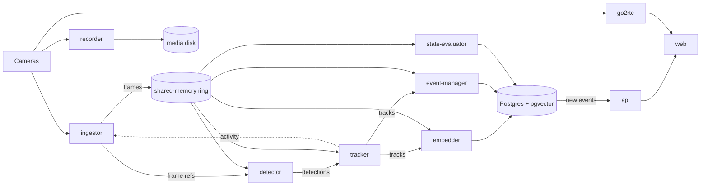

# BABA — Architecture

BABA is a set of small services around a message bus. Each camera is decoded
once; the decoded frames sit in shared memory, and every stage that needs a
frame reads it from there, while the bus carries only small messages about
what was seen. Postgres with pgvector keeps everything that must outlive a
restart: cameras, tracks, events, identities, recordings and settings.

## Principles

- **Decode once, read many.** One process decodes a camera, on the GPU where
  there is one, into a shared-memory ring. Bus messages carry a frame's
  sequence number, not its pixels: a full-resolution frame is several
  megabytes, and copying it to every subscriber would cost more than the
  inference.
- **The whole frame, every time.** Detection runs on full frames at a steady
  rate instead of behind a motion trigger, so a person standing still is not
  lost. A quiet scene lowers the frame rate; it never switches detection off.
- **Identity by the whole body.** People are matched across cameras and days
  by a body embedding. A visible face adds certainty but is never required.
- **Independent stages.** Each service subscribes to what it needs, so a slow
  stage falls behind on its own without stalling the others.
- **Hardware behind plug-in backends.** Inference and decoding are backends
  found by Python entry point. ONNX is the one model format; each backend
  compiles it for its hardware on first load and caches the result.
- **Permissive models by default.** Everything BABA downloads may be used
  commercially; models under other licenses are the operator's to bring (see
  [LICENSES.md](LICENSES.md)).

## Components

| Component | Role |
|---|---|
| `ingestor` | One decoder per enabled camera; writes frames to the shared-memory ring and adapts the frame rate to scene activity |
| `detector` | Batched transformer detection (RT-DETRv2, D-FINE) on the GPU; very wide frames are split into overlapping tiles |
| `tracker` | Per-camera tracking (Norfair with OSNet appearance); motion state (moving, stationary, parked) and the activity verdict the ingestor follows |
| `embedder` | Body embeddings (DINOv2) and faces (YuNet, AuraFace) for tracked objects, sampled from the ring |
| `event-manager` | Turns track lifecycles into durable tracks and events, zone entries, exits and dwell; thumbnails |
| `state-evaluator` | Scene states of fixed regions (a gate open, a garage door up), learnt from a few reference crops; license-plate reading when enabled |
| `recorder` | Continuous recording per camera without transcoding, in segments, with tiered retention |
| `doorbell` | Button presses from supported doorbells, as events |
| `hwstats` | CPU, memory and GPU gauges for the System page |
| `api` | REST and live updates (server-sent events), authentication, notification rules, zone drawing with SAM2, the AI assistant, database migrations |
| `web` | SvelteKit interface; proxies the API and the live-view streams |
| `nats` | Message bus |
| `postgres` | Postgres 18 with pgvector |
| `go2rtc` | Live view over WebRTC and snapshots |

## Data flow



A frame's path: the ingestor decodes it into the ring and publishes a
reference on `baba.frames.<camera>`. The detector reads the frame, runs the
model and publishes boxes; the tracker links boxes into tracks and publishes
them on `baba.tracks.<camera>`. The embedder and the event-manager both follow
the tracks: the embedder stores embedding samples, and when a track ends the
event-manager keeps its best sample, writes the track and its events, and
evaluates the zones it crossed. Postgres `NOTIFY` tells the API about new
events, and the API pushes them to the browser and runs the notification rules.

Recording is a separate path straight from the camera, so a slow detector can
never cost footage.

## Storage

| Store | Holds |
|---|---|
| Postgres (`/state`, fast disk) | Cameras, zones and rules; tracks, events and their embeddings (HNSW indexes); identities and reference photos; recording index; users and settings |
| Models (`/models`, fast disk) | ONNX models and the compiled engine caches |
| Media (`/media`, slow disk) | Recordings, event clips and thumbnails |
| Shared memory | The frame ring; nothing there survives a restart |

Schema changes are numbered SQL files in `db/migrations`, applied in order by
the API at start and recorded in `schema_versions`.

## Interfaces

- **HTTP API** at `:8080`, described by OpenAPI; the web interface uses a
  client typed from it. Live updates arrive as server-sent events.
- **Message bus** subjects under `baba.*`. The bus stays on the host unless
  its client or WebSocket port is published for a named peer.
- **DIDA** mirrors BABA's per-camera state (occupied zones, what is in view,
  scene states) and its camera roster from `baba.state.*` and `baba.roster`,
  and switches camera lights through BABA's API, authenticated as a peer. BABA
  decides what is true; DIDA derives nothing of its own.
- **Identities** can be seeded from photo libraries (OPUS, Immich) as
  reference photos.
- **Notifications** go out by e-mail, Slack, Telegram or webhook.

## Security

Users sign in with a password (Argon2) and an optional second factor with
recovery codes; the session is an HttpOnly cookie, marked Secure when BABA
runs behind TLS. The bus has its own accounts with generated credentials.
BABA serves plain HTTP and expects TLS from a tunnel or reverse proxy in front
of it; video leaves the host only through a channel the operator connects.

## Deployment

Everything runs in containers from one `docker-compose.yml`, with an override
per hardware variant:

| Variant | Detector | Other models | Decode | Frame ring |
|---|---|---|---|---|
| `nvidia` | TensorRT | ONNX Runtime (CUDA) | NVDEC | NV12 |
| `intel` | OpenVINO | OpenVINO | VAAPI, or Quick Sync on an iGPU | NV12 |
| `cpu` | ONNX Runtime | ONNX Runtime | software | RGB |

Each service runs exactly one backend per job, derived from its variant, and
refuses to start when that backend is unavailable; nothing falls back to the
CPU. The only per-host choice is the decoder (`BABA_DECODER_BACKEND`), for an
Intel iGPU that needs Quick Sync. `install.sh` picks the variant, lays out the
storage tiers and writes `.env`; `install.sh --upgrade` pulls or builds new
images and restarts. Images are published per variant to
`ghcr.io/bacinac/baba`.

## Extending

- **A detector model:** put an ONNX file into `BABA_MODELS_HOST` and select it
  in Settings; the backend compiles it on first load.
- **An inference backend or decoder:** a package in `backends/` that
  implements the protocol in `core/src/baba_core/backend.py` and registers an
  entry point under `baba.backends` or `baba.decoders`.
- **A notification channel:** a sender in
  `services/api/src/baba_api/notifications.py` and its settings form in the
  web interface.

## Repository layout

```
backends/     inference backends and video decoders, one package each
core/         baba_core: frame ring, wire types, model helpers, shared logic
services/     one directory per service listed above
web/          SvelteKit interface
db/           SQL migrations
docker/       base images per hardware variant
deploy/       deployment to own instances, TLS front ends, release publishing
tools/        model download and conversion
scripts/      backup and maintenance
tests/        test suite
install.sh    installer and upgrader
```
