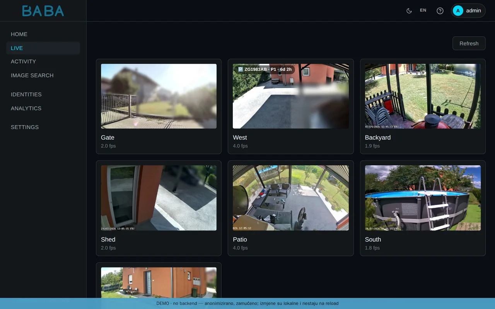
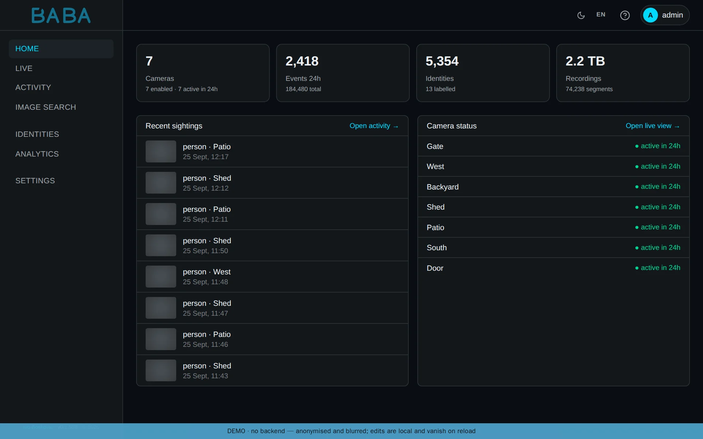
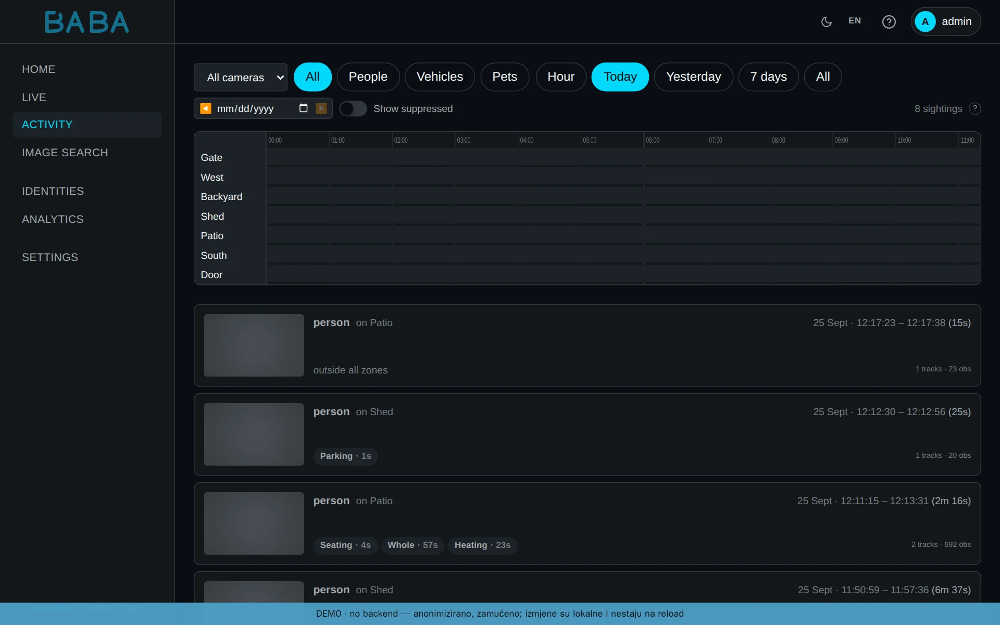
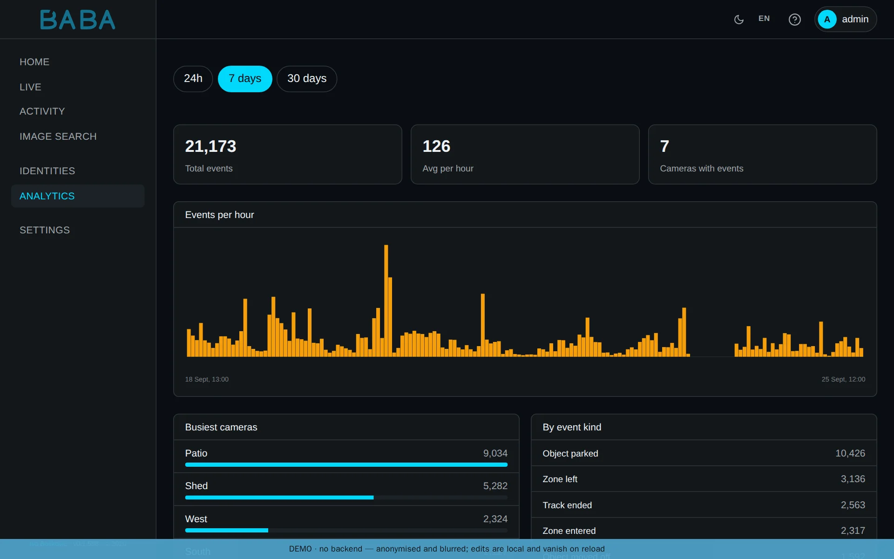

# BABA — Boundary-Aware Behavior Analytics

**Next-generation NVR built on modern ML models.**

*Baba* is Dalmatian for grandma: the one at the window who sees everything,
hears everything and remembers everyone. BABA gives a house the same attention.
It follows people and vehicles on every camera, knows them when they come back
and keeps a record of what happened where.

**Try it:** [demo-baba.boskovic.biz](https://demo-baba.boskovic.biz), the real interface with a made-up household inside.

<p align="center"></p>

<details>
<summary>More screenshots</summary>

**Live view:** every camera in one low-latency grid.


**Home:** the last day's events, recent sightings and the state of every camera.



**Activity:** every sighting on a timeline per camera, filtered by people, vehicles or pets.



**Analytics:** events per hour, the busiest cameras and what kind of events they were.



</details>

## What it does

It detects people and vehicles on every frame, follows them across the view and
recognises them when they return, on another camera or the next day in a
different jacket. Zones drawn on the camera view turn movement into events:
entering, leaving and staying too long, each with its own rules. A zone can be
drawn as a polygon or by clicking an object and letting SAM2 outline it, and an
optional AI assistant (Anthropic or OpenAI, with your own key) looks at the view
and proposes zones and rules.

It records every camera around the clock without transcoding, with a timeline to
scrub, clips cut on demand and retention in tiers. Small visual classifiers
trained from a handful of examples report scene states such as a gate open or a
garage door up. A photograph is enough to find a person across the whole
history. Alerts go out by e-mail, Slack, Telegram or webhook. Live view is a
low-latency WebRTC grid. Video stays on your own network unless you connect an
outside channel yourself.

## What sets it apart

BABA runs transformer detectors on the whole frame whether or not anything
moves, so a person standing still does not disappear, and it recognises people
by the whole body, so it keeps working through hoods, hats, sunglasses and a
turned head. Faces are an addition, not the foundation.

## How it works

Each camera is decoded once, on the GPU where there is one, and published as
frames on a message bus. Detection, tracking, re-identification, zone evaluation,
recording and events are separate services that subscribe to what they need, so
a slow stage does not stall the others.

The whole stack runs one hardware variant, chosen by the installer from the GPU
it finds (override with `--variant=`):

| Variant | Inference | Decode | When |
|---|---|---|---|
| `nvidia` | TensorRT + CUDA | NVDEC | NVIDIA host with `nvidia-container-toolkit` |
| `intel` | OpenVINO (Arc, iGPU, NPU) | software | Intel Arc or iGPU, with `docker-compose.intel.yml` |
| `cpu` | ONNX Runtime | software | anywhere, slowly; for trying it out |

Storage is split by speed:

| Container path | Host variable | Tier | Contents |
|---|---|---|---|
| `/models` | `BABA_MODELS_HOST` | fast (SSD/NVMe) | ONNX models and compiled engine caches |
| `/state` | `BABA_STATE_HOST` | fast (SSD/NVMe) | Postgres data, API secret key |
| `/logs` | `BABA_LOGS_HOST` | fast (SSD/NVMe) | application logs |
| `/media` | `BABA_MEDIA_HOST` | slow (HDD) | recordings, event clips, thumbnails |

`/media` grows to terabytes and belongs on its own disk or array; the installer
warns when it lands on the same filesystem as the fast tier. The system map is
in [ARCHITECTURE.md](ARCHITECTURE.md).

## Technology

RT-DETRv2 and D-FINE for detection, Norfair with OSNet appearance for tracking,
DINOv2 for re-identification across cameras and days, YuNet and AuraFace for
faces, SAM2 for zones. FastAPI, NATS, Postgres 18 with pgvector,
SvelteKit 2 and Svelte 5, go2rtc for live view. TensorRT on NVIDIA, OpenVINO on
Intel, ONNX Runtime on the CPU. Everything runs in containers.

## Install

BABA needs Docker with Compose, and for the `nvidia` variant the NVIDIA
Container Toolkit.

```bash
git clone https://github.com/Bacinac/baba.git
cd baba
./install.sh
```

The installer detects the hardware, asks where the fast and slow storage live,
creates the administrator (the password is written to
`state/api/bootstrap_admin_password`), generates the bus credentials, asks for
the public hostname and downloads the default models (about 430 MB). Images are
pulled prebuilt from `ghcr.io/bacinac/baba`; when the registry is unreachable
they are built from source, and `--build` or `--pull` forces one or the other.
A checkout of a release tag (`git clone --branch <release> …`, the latest is
on the Releases page) pulls the images built from exactly that release.
At the end it prints the address of the dashboard, where a setup wizard takes
over for cameras, the AI provider, notification channels and rules.

For an unattended install:

```bash
./install.sh --non-interactive \
  --variant=nvidia \
  --media-host=/srv/baba/media \
  --admin=ops \
  --hostname=baba.example.com \
  --models=minimal
```

All options: `./install.sh --help`.

**TLS.** The installer does not terminate TLS. BABA serves plain HTTP on
`:5173` (web) and `:8080` (API); put Cloudflare Tunnel, Caddy
(`deploy/caddy/docker-compose.caddy.yml`) or Traefik v3
(`deploy/traefik/docker-compose.traefik.yml`) in front of it, and set
`BABA_COOKIE_SECURE=true` and `BABA_CORS_ORIGINS=https://<host>`, or pass
`--hostname=` and let the installer do it. Details in
[deploy/README.md](deploy/README.md).

## Upgrade

```bash
./install.sh --upgrade        # pull, rebuild, restart; configuration kept
./install.sh --reconfigure    # through the wizard again; secrets kept
```

An upgrade never changes an existing value in `.env` except `BABA_IMAGE_TAG`,
which follows the checked-out release, and a flag that would
(`--variant`, `--media-host`, `--admin`, `--hostname`) is refused alongside
`--upgrade`. Without it the same flags run a reconfigure, which changes only
what the wizard asks and keeps a `.env.bak.*` copy. New settings from a newer
release are appended. `BABA_SECRET_KEY` is generated exactly once, because
rotating it would sign everyone out.

## Development

```bash
docker compose up -d
```

Web on `:5173`, API on `:8080`. A release (build, push of each variant, git tag)
is `deploy/publish.sh <variant>`; see [deploy/README.md](deploy/README.md).

## License

BABA is licensed under [PolyForm Noncommercial 1.0.0](LICENSE.md): free for
personal and non-commercial use. Commercial use requires a separate license;
write to [ivo.boskovic.zg@gmail.com](mailto:ivo.boskovic.zg@gmail.com).
External contributions (pull requests) are not accepted.

Required Notice: Copyright (c) 2026 Ivo Bošković

The models BABA ships by default are licensed for commercial use (Apache 2.0,
MIT). Ultralytics YOLO is not shipped because of its AGPL-3.0 license; you can
bring your own ONNX model into `BABA_MODELS_HOST`. Details in
[LICENSES.md](LICENSES.md).
